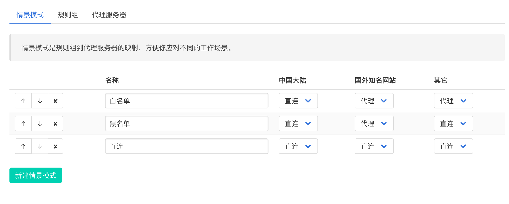
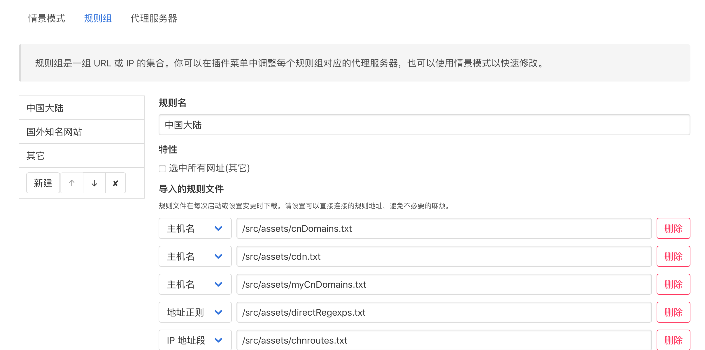

# Proxy-Proxy

**WIP** - 本项目正在早期开发中

[下载最新版](https://github.com/oott123/proxy-proxy/releases/latest)

Proxy-Proxy 是一个自动切换代理的 Firefox 插件。

## 特色

* 自动解析 IP 地址，按 IP 段分流
* 也可以按域名分流
* 自定义情景模式快速切换代理规则
* 所有设置完全同步
  * 但当前正在使用的代理规则不同步，因此你可以在不同电脑上使用不同的代理规则，同时保持其它选项同步！

## 截图

